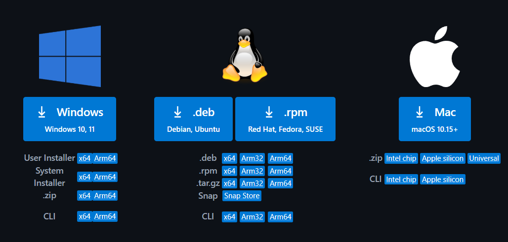
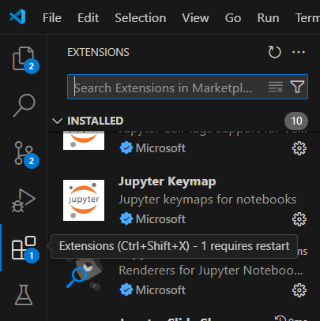

# Guia para ejecutar y entender este repositorio
### Creador y Desarrollador:
Santino Tosetti Legajo: 26029/4

### Versiones: 
Como instalar python: https://python-unlp.github.io/blog/2023/04/22/instalaci%C3%B3n-de-python/
Como instalar Jupyter: https://python-unlp.github.io/blog/category/jupyter-notebook/
Python 3.12.9
Jupyter 2025.2.0

### Como crear un entorno virtual
Trabaje sobre el entorno virtual de pyton venv, explicacion y creacion: 
https://python-unlp.github.io/blog/2023/04/29/entornos-virtuales/

### Se ejecuto y se desarrollo en el entorno Visual Studio Code
Descarga Visual Studio Code: https://code.visualstudio.com/Download
 Selecciona tu dispositivo y descarga
Abri el programa y aceptar todo

### Entrar en la parte de extensiones y descargar las siguientes: 
 Buscar la parte de extensiones y en la lupa escribir los siguientes nombres(o usar los links)
Pylance https://marketplace.visualstudio.com/items?itemName=ms-python.vscode-pylance
Jupyter https://marketplace.visualstudio.com/items?itemName=ms-toolsai.jupyter
Python https://marketplace.visualstudio.com/items?itemName=ms-python.python
Python Debugger https://marketplace.visualstudio.com/items?itemName=ms-python.debugpy

### Se compila y se ejecuta usando la extension Python Debugger y la extension de jupyter
Ejecutar el programa en la parte de notebooks, importar las funciones ejecutando el primer bloque de codigo, ejecutar cada parte de codigo individualmente

## Entrar para ver el video de explicacion del Ejercicio 10
https://youtu.be/H_XNLAw6GkM

